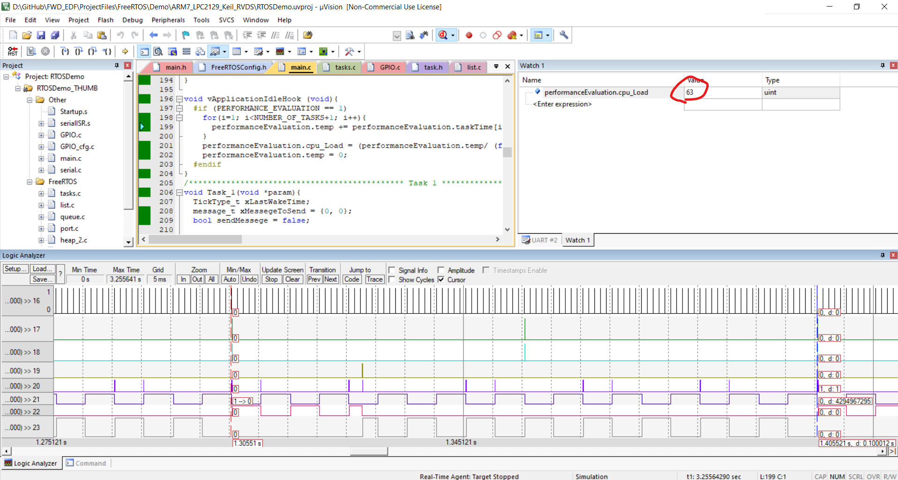
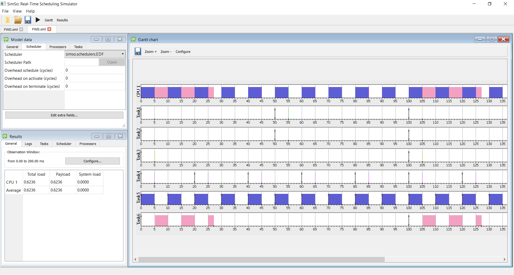

# FWD_EDF
The Second out of Three Projects in the advanced embedded systems nanodegree funded by FWD and provided by Sprints using UDACITY Learning

## Youtube Video Link:
https://www.youtube.com/watch?v=hVQGRwDhzAQ

## Screenshots
### 1. Keil uVision Logic Analyzer View

 

### 2. SimSo Offline Simulator Analysis and Gantt Chart View

  

## Future Work
- Improve the state machine implementation of task1 and task2 readings from a simple input driven state machine to a professional event driven state machine
- use QM Modling Tool to generate the state machiness code based on the qpc framework for active objects. 

 

### Overall The project was to much fun and i learned a lot doing it.
